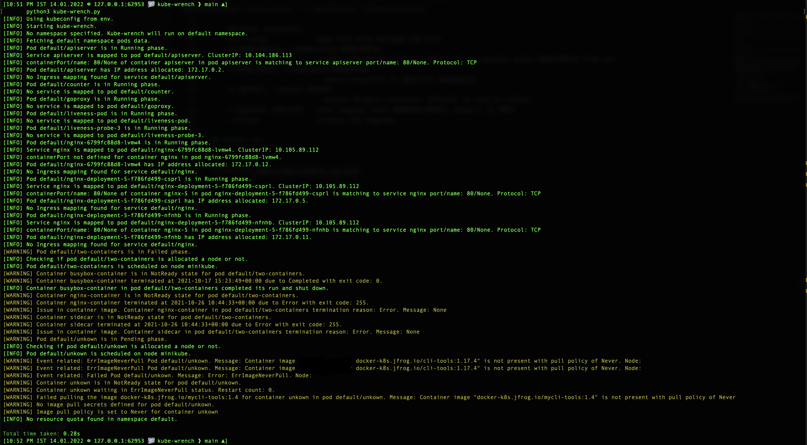

## kube-wrench

An automated way on troubleshooting Kubernetes deployments. This tool is based on visual guide on [troubleshooting Kubernetes deployment](https://learnk8s.io/troubleshooting-deployments).

## Pre-requisites

1. python3 and [packages](requirements.txt)

2. `pip3` needs to be installed to get required packages. You need to install above packages with command:x

    pip3 install -r requirements.txt

3. KUBECONFIG for the cluster needs to be exported as env. It is read by kube-wrench to connect to the cluster to get details.

## How to run kube-wrench

### running kube-wrench directly using python

Once above pre-requisites are installed and configured, you are ready to run kube-wrench as below after cloning the repo:

1. Change dir:

    cd kube-wrench

2. Run script:

    python3 kube-wrench.py

### running by using docker image

Running through docker image would be much easier than installing dependencies on your machine. The docker image being used is based on `python:3.8-slim-buster` which is a very light weight version of python in docker.

If you want a ready-made env to run kube-wrench, please check [dguyhasnoname/kube-wrench](https://hub.docker.com/repository/docker/dguyhasnoname/kube-wrench) for latest image.

Pulling docker image:

    docker pull docker.io/dguyhasnoname/kube-wrench:0.1.0

Running the docker image:

    docker run -it --rm -v ~/k8sconfig/ct/:/app/k8sconfig/ -e KUBECONFIG=/app/k8sconfig/kubeconfig.yaml docker.io/dguyhasnoname/kube-wrench:0.1.0

## kube-wrench help

    python3 kube-wrench.py -h
    usage: kube-wrench.py [-h] [-k KUBECONFIG] [-n NAMESPACE] [-o OUTPUT] [--loglevel LOGLEVEL] [--silent]

    This script can be debug issues in a namespace in a Kubernetes cluster.

    Before running script export KUBECONFIG file as env:
    export KUBECONFIG=<kubeconfig file location>

    e.g. export KUBECONFIG=/Users/dguyhasnoname/kubeconfig

    ALternatively kubeconfig can be passed as argument.

    optional arguments:
    -h, --help            show this help message and exit
    -k KUBECONFIG, --kubeconfig KUBECONFIG
                            pass kubeconfig of the cluster. If not passed, picks KUBECONFIG from env
    -n NAMESPACE, --namespace NAMESPACE
                            check resources in specific namespace.
    -o OUTPUT, --output OUTPUT
                            output formats json|text. Default is text on stdout.
    --loglevel LOGLEVEL   sets logging level WARNING|DEBUG. default is INFO
    --silent              silence the logging.

## Sample run

